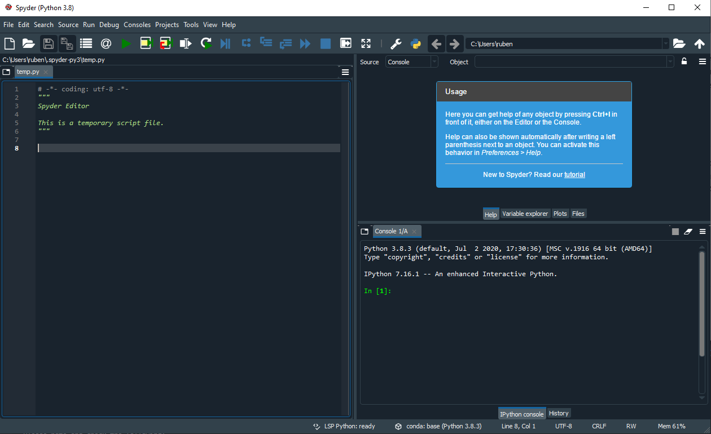
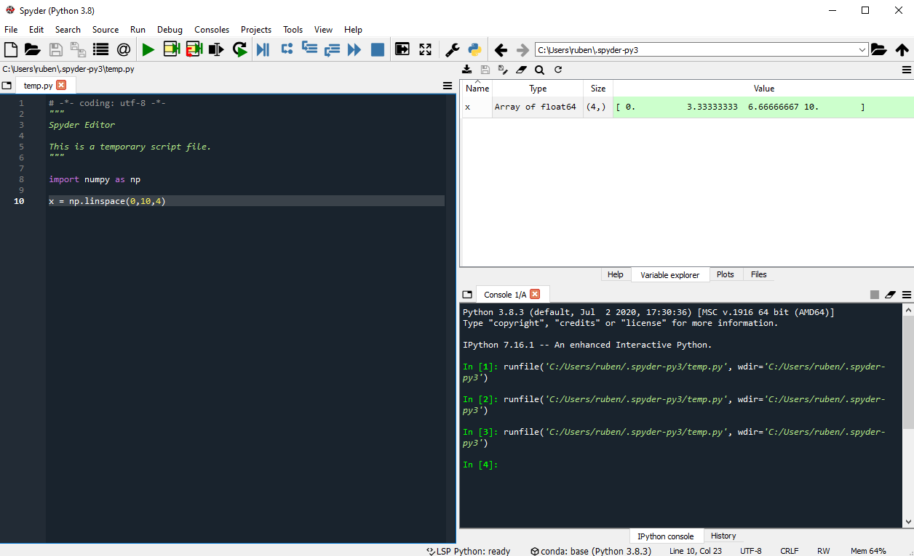
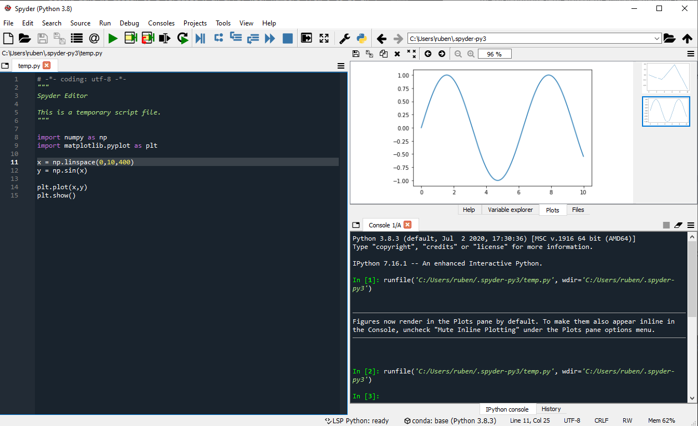
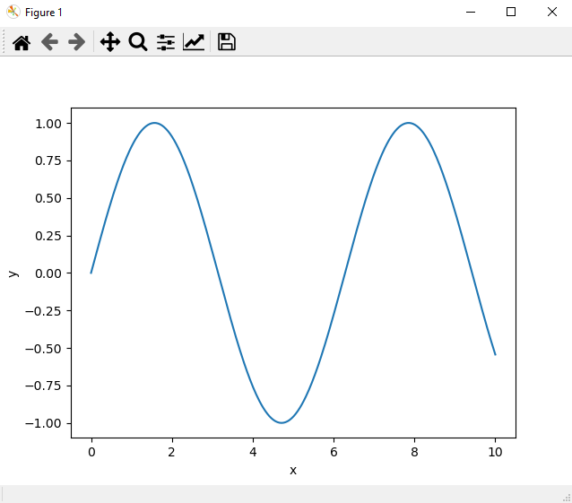

# Introduction
Now that you have a python setup, it is time to see what it can do. The following instructions will assume you have Anaconda installed. For those of you who manage their own python distribution and packages, make sure the example program runs and gives the desired output. I will give a VS Code example at the end of this page

# Spyder (Anaconda)
We will be using the spyder IDE from anaconda. To launch it, press the windows button and search for spyder, you will find something like `spyder (anaconda3)`. If that did not work start the Anaconda Navigator from your start menu and launch spyder from there.

## A first look at spyder
If you start spyder for the first time you will see something like this. 



We have a text editor on the left and a help and console on the right. Note that the top right panel has 4 tabs, we will see in a bit that the `variable explorer` is very useful.

You can customize the look and feel of spyder. It can mimic Matlab and RStudio layouts, if you are comfortable with these layouts, switching to them is easy, go to `view -> window layouts` and pick your favorite one. Here we will stick to the default, but I will change the appereance by going to `Tools -> Preferences -> Appearence` and change the interface theme to light (this is completely optional).

## Using spyder
Now let's use spyder, copy paste the following code into the text editor.
```python
import numpy as np

x = np.linspace(0,10,4)
```

The first line will import the package numpy and rename it to np. In the second line we assign to a variable x an array with numbers from 0 to 10 in 4 steps. To run the code press the play button at the top of the window (if it gives you a pop-up just press run). If you open the `variable explorer` tab we can see what has happened. We have created the variable `x` and can see its contents.


### Plotting A Sine Wave
To plot a sine wave copy paste the following code in the text editor and press play again.
```python
import numpy as np
import matplotlib.pyplot as plt

x = np.linspace(0,10,400)
y = np.sin(x)
plt.plot(x,y)
```
Next to the `variable explorer` is the `plot` tab if you open it you can see the generated plot.



### Plots In A Separate Window
It seems nice that plots are rendered in spyder, but it will turn out to be annoying very quickly, if you for example want to make changes to it (zoom in, select certain bits etc.) you simply cannot do it. Luckily enough we can render plots in a separate window with an interactive mode. Go to `Tools -> Preferences -> Ipython Console` then select the `graphics` tab and change the backend to `Automatic`. If you restart spyder and rerun the previous code you will get a nice seperate plot that is interactive. 

Lets add labels to the axes, press the (increasing) graph button at the top of the figure window and type your labels in the labels fields. After adding the labels you will have something like the following figure.



## The Spyder Console
So far we have just run python files from the text editor. A nice feature of spyder is that it also has an interactive python console. You can test commands there and even define variables and do computations with them. Try the following commands for example:

```python
In [ ]: a = 3
In [ ]: b = 4
In [ ]: a + b
```

Have a look at your `variable explorer` now and see that it added `a` and `b`. 


## The End
This is the end of this introduction to the spyder IDE. If you have generated a sine wave plot, you should be all set for this course. If you already want to start learning more about what python can do for you have a look at our [Not working on website](https://google.com)


# Only for VS Code Users
Open VS Code, create a new file named `example.py` and copy paste the following code.

```python
import numpy as np
import matplotlib.pyplot as plt

x = np.linspace(0,10,400)
y = np.sin(x)

plt.plot(x,y)
plt.show()
```


> **IMPORTANT** note the extra `plt.show()` that we did not use in spyder. This extra statement is needed because if we run python in a terminal or from VS Code it is in non-interactive mode, to get an interative plot, we need to specifically ask for it with the `show()` command.

If you have the python extension installed, you should have a green triangle (play button) at the top of your page, click the triangle and you should get a picture of a sine wave. If you exit the plot the program will terminate automatically.