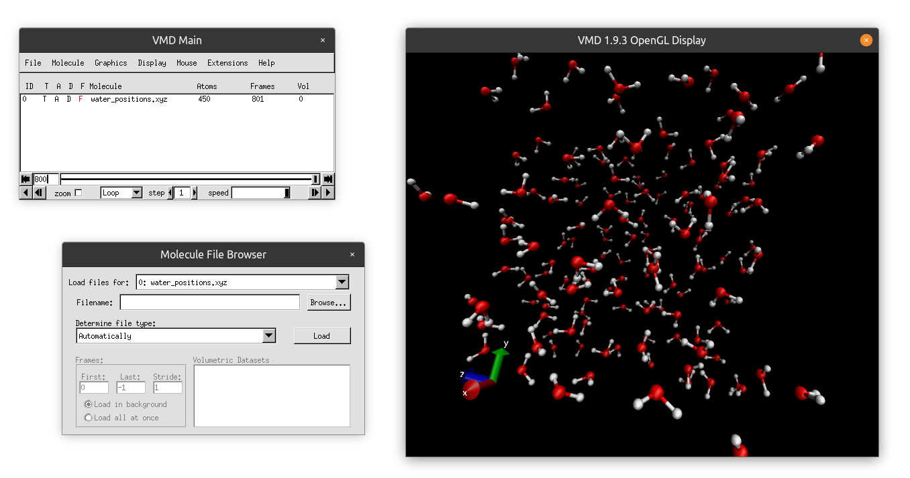

# Introduction
Here we will discuss some basics of the software package named Visual Molecular
Dynamics (VMD). It can be used to make fancy graphics, such as the banner of the
course homepage, and also movies.

# Installing VMD
You can download the VMD software
[here](https://www.ks.uiuc.edu/Development/Download/download.cgi?PackageName=VMD)
(if the link does not work try [this](http://www.ks.uiuc.edu/Research/vmd/)).
Select the latest stable release for you system, most likely version 1.9.3 for
Windows with OpenGL, if you have a nvidia graphics card you can also try the
CUDA version. 

You will need to register with your email and accept some terms. Feel free to
read the license agreement if you wish. Rest assured that this software is free
for us. Once installed, VMD can be found in the start menu. Launch it. You
should get two windows, one old looking menu and a black screen with the
cartesian axis and a spinning VMD logo. VMD looks like a really old piece of
software, but don’t let that fool you. It is quite powerful and can be used to
make all kinds of advanced animations. We encourage you to play around with it.
[Here](http://www.ks.uiuc.edu/Training/Tutorials/vmd/tutorial-html/node2.html)
is a VMD tutorial. You will not need most of the advanced features covered
there.

# Loading a Trajectory into VMD
This is quite straight forward. Go to `File -> New Molecule -> Browse ...`
Browse to a trajectory file and click Load. Then you can click the little play
buttons at the bottom of the gray windows to play the movie. The movie is played
in the black screen. Try to load the `Water.xyz` trajectory of the first week.
This trajectory should look nice and smooth, the other trajectories might have
some erritac jumps. 

# Changing the look of the animation
In the initial menu go to the graphics tab and select `Representations`. Change
the drawing method to `CPK` and see what happens to the molecules. You can play
around with different drawing methods and pick your favorite. 

To change color schemes, for example the color of the background, go to the same
graphics tab and select `Colors`, next press Display and then Background and
select the color you like. You can also play around with the rgb slider at the
bottom of this window.

# Making Pictures
Getting nicely rendered images from VMD can be a bit tricky. In my opinion the
easiest way is to press `File -> Render`, set the current renderer to `Tachyon`,
change the filename to your liking and update the Render Command by adding the
following bit of code `-res 1920 1080` to set the resolution of the rendered
image. Here 1920 by 1080 is the standard HD resolution.

# Making Movies
VMD also comes with a tool to make movies, you can find it under `Extensions ->
Visualization -> Movie Maker`. The movie maker may (depending on your
windows/linux installation) require extra software to generate the movie. If
this is the case VMD will tell you so and google is your friend for getting the
right extra software. Also here it is worth while to change the renderer to
Tachyon for higher quality images, if nothing seems to work though, screen
capture is also fine.

